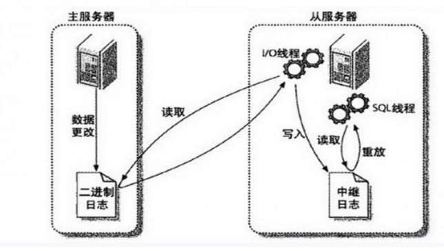
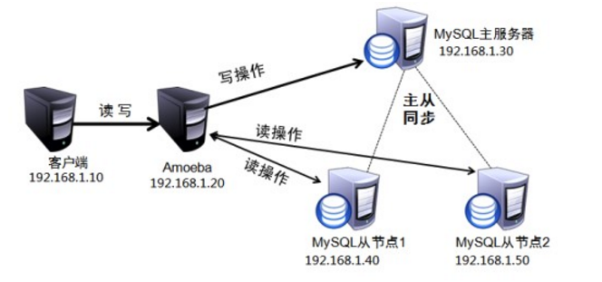

# Distributed Blog System


## 场景模拟

- 假设一个博客系统拥有 10<sup>5</sup> 用户，每个用户平均有 10 篇的文章，每篇文章平均大小为 1kb，那么存储这些文章总共需要大约 1GB 的空间。

- 假设每个时间点有 10<sup>3</sup> 名活跃用户，每个用户大概浏览 5 篇文章。

- 假设热点文章为 10<sup>4</sup>，热点文章需要大约 10MB 的空间。

## 解决方案

- 根据博客系统读多写少的特性，数据库端可以使用主从架构来实现读写分离，并且从服务器可以使用 MyISAM 这种读性能比较高的存储引擎；

- 根据博客系统热点文章突出的特性，使用 Redis 对热点文章进行缓存，并且使用 volatile-lru 这种最近最少未使用的策略来淘汰数据，以保证 Redis 存储的数据都为热点数据。

- 为了进行分页，需要记录文章总量，可以使用 Redis 来记录这种计数量。同样地，每篇文章都要记录阅读量，阅读量也可以使用 Redis 进行记录。

## 功能实现

本次实现主要是对服务器端进行设计，从而提高系统的性能，因此功能方面实现的比较少，只具有阅读文章以及发布文章两个功能。

## 运行环境

本系统运行在两台硬件一致和软件配置一致的云服务器上。

### 硬件

- CPU : 1  Intel(R) Xeon(R) CPU E5-26xx v4
- 内存 :  Size: 1024 MB Type: RAM

### 软件

- Linux : version 2.6.32-642.6.2.el6.x86_64
- MySQL : Ver 14.14 Distrib 5.1.73
- Redis : v=4.0.8

## 性能测试

使用 Apache 的 ab 来进行压力测试。

为了防止网络时延的影响，因此在服务器端进行测试。

使用以下命令来使用 ab 工具，其中 -c 参数为并发数，-n 参数为请求数，-k 参数表示持久连接，http://localhost/dblog 就是待测试的网站。

```
ab -c 1000 -n 5000 -k http://localhost/dblog
```

在使用 Redis 进行缓存以及使用主从架构来实现读写分离之前，进行以上测试得到的部分结果如下，可以看出可以每秒平均的请求数为 715.81。


```
Time taken for tests:   6.985 seconds
Total transferred:      2645529 bytes
HTML transferred:       1530306 bytes
Requests per second:    715.81 [#/sec] (mean)
```

而在使用 Redis 以及主从架构之后，测试的结果如下，每秒平均的请求数以及提高到了 4839.62，大大提高了网站的并发请求数。

```
Time taken for tests:   1.033 seconds
Total transferred:      2696313 bytes
HTML transferred:       1559682 bytes
Requests per second:    4839.62 [#/sec] (mean)
```

## 主从复制原理

### 1. 主从复制



主要涉及三个线程：binlog 线程、I/O 线程和 SQL 线程。

1. **binlog 线程**：负责将主服务器上的数据更改写入二进制文件（binlog）中。
2. **I/O 线程**：负责从主服务器上读取二进制日志文件，并写入中继日志中。
3. **SQL 线程**：负责读取中继日志并重放其中的 SQL 语句。

### 2. 读写分离



主服务器用来处理写操作，而从服务器用来处理读操作。

读写分离常用代理方式来实现，代理服务器接收应用层传来的读写请求，然后决定转发到哪个服务器，例如 Amoeba 代理服务器。

MySQL 读写分离能提高性能的原因在于：

1. 主从服务器负责各自的读和写，极大程度缓解了锁的争用；
2. 从服务器可以配置 MyISAM 引擎，提升查询技能以及节约系统开销；
3. 增加冗余，提高可用性。

## 主从复制配置

### 1. 创建复制账号

在主从服务器都创建用于复制的账号，并且账号必须在 master-host 和 slave-host 都进行授权，也就是说以下的命令需要在主从服务器上都执行一次。

```
mysql > grant all privileges on *.* to repl@'master-host' identified by 'password';
mysql > grant all privileges on *.* to repl@'slave-host' identified by 'password';
mysql > flush privileges;
```

完成后最好测试一下主从服务器是否能连通。

```
mysql -u repl -h host -p
```

### 2. 配置 my.cnf 文件

主服务器

```
[root]# vi /etc/my.cnf

[mysqld]
log-bin   = mysql-bin
server-id = 10
```

从服务器

```
[root]# vi /etc/my.cnf

[mysqld]
log-bin           = mysql-bin
server-id         = 11
relay-log         = /var/lib/mysql/mysql-relay-bin
log-slave-updates = 1
read-only         = 1
```

重启 MySQL

```
[root]# service mysqld restart;
```

《高性能 MySQL》书上的配置文件中使用的是下划线，例如 server_id，使用这种方式有误在当前版本的 MySQL 中不能使用。

### 3. 启动复制

先查看主服务器的二进制文件名

```
mysql > show master status;
```

```
+------------------+----------+--------------+------------------+
| File             | Position | Binlog_Do_DB | Binlog_Ignore_DB |
+------------------+----------+--------------+------------------+
| mysql-bin.000002 |      106 |              |                  |
+------------------+----------+--------------+------------------+
```

然后配置从服务器

```
mysql > change master to master_host='master-host',             > master_user='repl',
      > master_password='password',
      > master_log_file='mysql-bin.000002',
      > master_log_pos=0;
```

在从服务器上启动复制

```
mysql > start slave
```

查看复制状态，Slave_IO_Running 和 Slave_SQL_Running 必须都为 Yes 才表示成功。

```
mysql > show slave status\G;
*************************** 1. row ***************************
               Slave_IO_State: Waiting for master to send event
                  Master_Host:
                  Master_User: repl
                  Master_Port: 3306
                Connect_Retry: 60
              Master_Log_File: mysql-bin.000002
          Read_Master_Log_Pos: 106
               Relay_Log_File: mysql-relay-bin.000006
                Relay_Log_Pos: 251
        Relay_Master_Log_File: mysql-bin.000002
             Slave_IO_Running: Yes
            Slave_SQL_Running: Yes
            ...
```

### 4. 读写分离实现

使用了 ThinkPHP 框架自带的读写分离支持。
